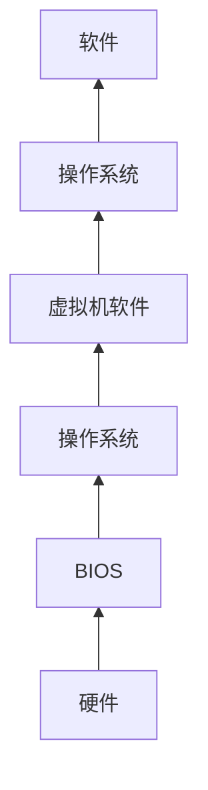
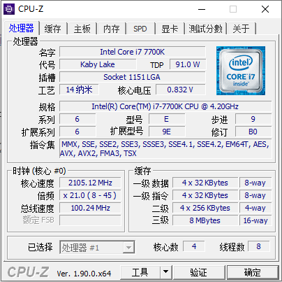
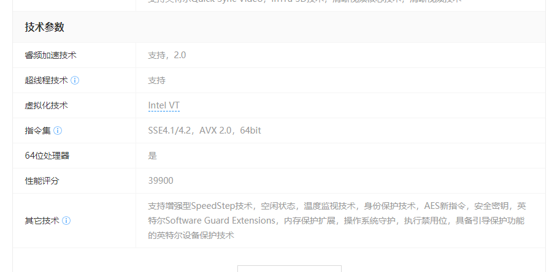

# 虚拟机安装

虚拟机（Virtual Machine）指通过[软件](https://baike.baidu.com/item/软件/12053)模拟的具有完整[硬件](https://baike.baidu.com/item/硬件)系统功能的、运行在一个完全[隔离](https://baike.baidu.com/item/隔离/33079)环境中的完整[计算机系统](https://baike.baidu.com/item/计算机系统/7210959)。在实体计算机中能够完成的工作在虚拟机中都能够实现。在[计算机](https://baike.baidu.com/item/计算机/140338)中创建虚拟机时，需要将实体机的部分硬盘和内存容量作为虚拟机的硬盘和内存容量。每个虚拟机都有独立的[CMOS](https://baike.baidu.com/item/CMOS/428167)、硬盘和[操作系统](https://baike.baidu.com/item/操作系统/192)，可以像使用实体机一样对虚拟机进行操作。（来源百度百科）

虚拟机技术有许许多多，目的就是为了虚拟出一块单独的区域/沙箱，起到隔离宿主机/模拟真实环境/运行特定版本的系统/软件的作用，本文只对操作系统级别的虚拟机展开。

## 名词解释

1. Virtualization: [硬件虚拟化技](https://baike.baidu.com/item/%E7%A1%AC%E4%BB%B6%E8%99%9A%E6%8B%9F%E5%8C%96) 一种对计算机或操作系统的虚拟。[虚拟化](https://baike.baidu.com/item/虚拟化/547949)对用户隐藏了真实的计算机硬件，表现出另一个抽象计算平台。
2. PAE: Physical Address Extension 物理地址扩展 扩展32位操作系统的内存地址长度到36位,以使用4G以上的内存,最高支持64G内存
3. NX: NoExecute 一种硬件执行数据保护技术,通过将内存地址标识为'不可执行',防止恶意代码及病毒运行     

## 为什么要使用虚拟机

作为一个程序员，第一步应该了解软件运行的基础，用一张简单的图来表示：

宿主机：虚拟机的载体就是“宿主机”(host)，有的称为“主机”。

## 如何选择虚拟机

下面列出了几个常用的虚拟机，其中Hyper-V是不允许其他的虚拟机共存的，使用了Hyper-V，其余的虚拟机都无法运行。

| 名称 | Hyper-V              | Oracle VM virtualBox | VMware Station     |
| ---- | -------------------- | -------------------- | ------------------ |
| 免费 | √                    | 个人免费             | ×                  |
| 厂商 | 微软                 | 甲骨文               | VMware             |
| 平台 | Window               | Window/Linux/MacOS   | Window             |
| 共存 | 不允许其他虚拟机共存 | 允许其他虚拟机共存   | 允许其他虚拟机共存 |
| 用户 | 商业/个人            | 商业/个人            | 商业               |

## Oracle VM VirtualBox 

通过百度搜索Oracle VM VirtualBox，在官网上下载可以减少安装包带病毒的几率。

### 官方文档

https://www.virtualbox.org/wiki/Documentation

### 硬件要求检查

#### CPU指令集要求

Oracle VM VirtualBox官方文档中只有对CPU要求支持SSE2指令集

> Host CPU Requirements SSE2 is required, starting with Oracle VM VirtualBox version 5.2.10 and version 5.1.24.

可以使用CPU-Z来检查cpu指令集，下图就是cpu-z的界面截图，观察指令集那一项中是否包含SSE2就表示CPU支持SSE2指令集。

#### CPU是否支持虚拟化

安装虚拟机CPU必须要求支持虚拟化，非常老的CPU可能就不支持了，我们可以在zol.com.cn上查询自己的CPU型号，在技术参数-虚拟化技术中查看是否支持虚拟化。也可以直接在CPU官网上查询CPU的参数。

### 安装前准备

1. 关闭Hyper-V
2. 在BIOS中开启CPU虚拟化
3. 准备40G空闲硬盘空间

### 安装虚拟机

### 安装操作系统

