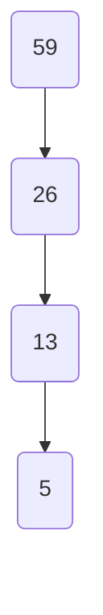
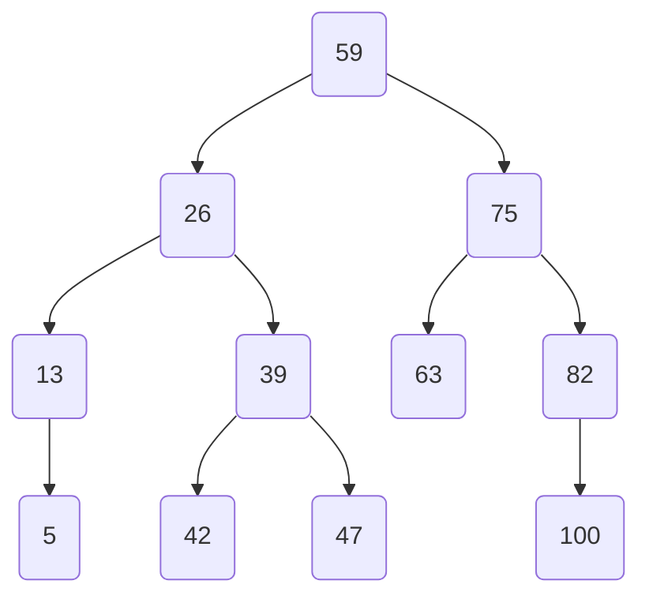

# 什么是树

例子中使用Java语言和lombok来自动实现构造函数

先了解什么是链表，链表是一个每一项都指向前一个节点或后一个节点的数组



 ```java
public class LinkList {
  @Setter
  @Getter
  private String val;
  @Setter
  @Getter
  private LinkList pre;
  public LinkList(String val, LinkList pre) {
    this.val = val;
    this.pre = pre;
  }
}
 ```

树是在链表的基本上再加一个或多个节点，为了简便，把上面链表的pre修改成left，再加了一个right节点，下面是一个有序的



```java
public class TreeNode {
  @Setter
  @Getter
  private String val;
  @Setter
  @Getter
  private TreeNode left;  
  @Setter
  @Getter
  private TreeNode right;
  public TreeNode(String val, TreeNode left, TreeNode right) {
    this.val = val;
    this.left = left;
    this.right = right;
  }
}
```

树其实就是链表的升级版